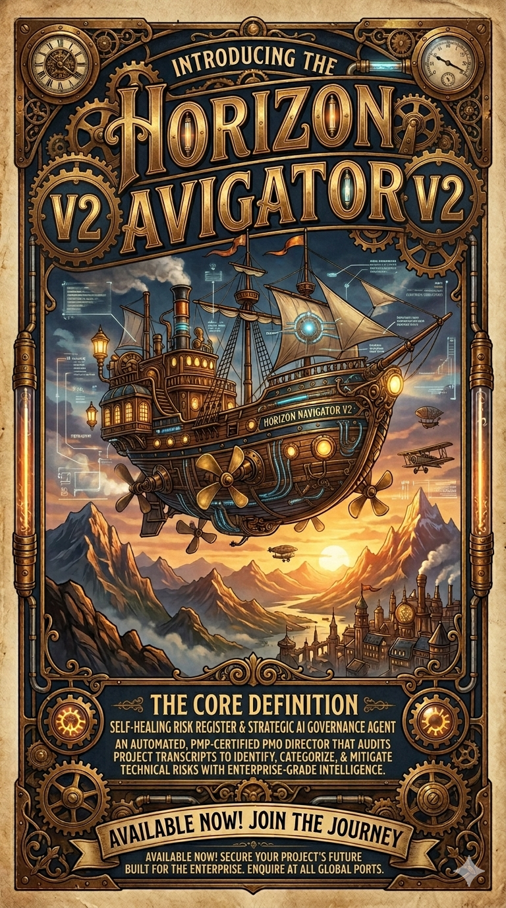

# 🧭 Horizon Navigator V2 // Autonomous AI Governance Agent



> **Static risk logs are dead. The future of enterprise project management is self-healing.**

## 👁️ The Vision
Horizon Navigator V2 is not a traditional tracking tool—it is a **Strategic AI Governance Agent** engineered to operate as an automated, PMP-certified PMO Director. 

It audits unstructured project meeting transcripts, identifies hidden technical risks, and automatically generates data-backed mitigation strategies. By mapping complex dialogue to an international **Risk Breakdown Structure (RBS)** at LLM speed, Horizon Navigator bridges the gap between raw project conversation and executive-level governance.

## ⚙️ The Engine Room (Architecture)
Built for high-stakes enterprise environments, this project utilizes a secure, high-performance, serverless Retrieval-Augmented Generation (RAG) architecture:

* **🧠 Contextual Reasoning Engine:** Powered by Anthropic **Claude 3 Haiku/Sonnet** (via Amazon Bedrock) to detect hidden risks, assess stakeholder sentiment, and deliver deterministic mitigation plans.
* **📚 PMP Knowledge Base & Memory:** A **Pinecone** Vector Database paired with **AWS Titan Text Embeddings** enables sub-second retrieval of historical project data and international PM standards.
* **🛡️ Privacy-First Design:** A strict "Security-by-Design" architecture ensures **PII Redaction** and credential isolation, keeping sensitive project data secure before it ever hits the model.
* **🖥️ Command Center UI:** A custom **Streamlit** "Black Edition" dashboard featuring stateful session management, real-time infrastructure telemetry, and aggressive, high-contrast styling.


## 🚀 Key Innovations
* **The Self-Healing Risk Register:** Moves beyond static spreadsheets. The system generates data-backed, evolving mitigation strategies that adapt to the context of the conversation.
* **Semantic Risk Mapping:** Dialogue is programmatically categorized into professional RBS pillars (e.g., *Technical Architecture*, *Legal Compliance*, *Resource Allocation*).
* **Zero-Trust Security Standard:** Employs explicit `.env` isolation and dynamic AWS credential management for safe, localized deployment and demonstration.

## 🛠️ Ignition Sequence (Local Setup)

1. **Clone the Fleet:**
   ```bash
   git clone [https://github.com/yourusername/horizon-navigator-v2.git](https://github.com/yourusername/horizon-navigator-v2.git)
   cd horizon-navigator-v2
